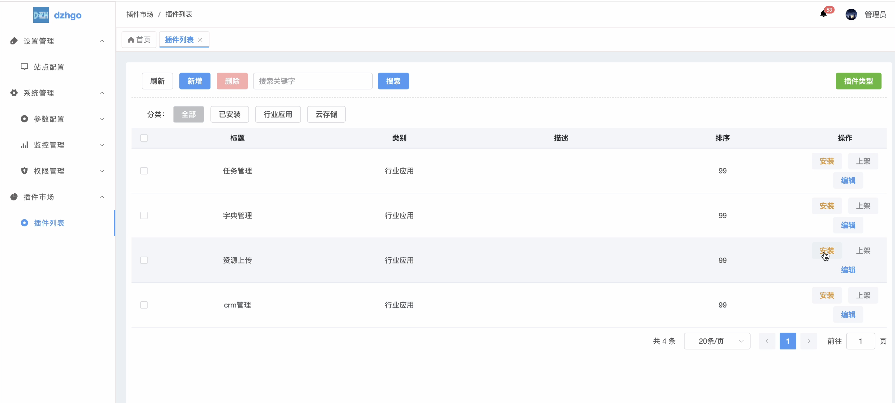

# dzhgo

## 扫码加好友拉群


## dzhgo后台界面


## 主程序dzhgo
### github
* 后台项目地址：https://github.com/gzdzh-cn/dzhgo-admin
* 前端项目地址：https://github.com/gzdzh-cn/dzhgo-admin-vue


### gitee
* 后台项目地址：https://gitee.com/gzdzh_cn/dzhgo-admin
* 前端项目地址：https://gitee.com/gzdzh_cn/dzhgo-admin-vue.git


## 使用

1. 安装依赖

```bash
go mod tidy
```

2. 运行

```bash
gf run main.go
```

3. 打包静态文件
```bash
gf pack public,resource,manifest packed/data.go -k
```

## 集成命令

Makefile 中集成了一些常用的命令，可以直接使用 `make` 命令执行。

```bash
clean                          清理项目,用于删除开发容器及存储卷,需在本地开发环境执行
help                           查看帮助
init                           初始化项目,用于在开发容器生成后配置一些常用镜像,如: golang, nodejs, docker
mysql-backup                   备份mysql
mysql-down                     停止mysql
mysql-up                       启动mysql
redis-down                     停止redis
redis-up                       启动redis
setmirror                      设置国内镜像源,用于在开发容器生成后配置国内镜像源
```

这是一个基于 **Wails v3** 的桌面应用项目，以下是启动方式：

1. **安装 Wails v3 CLI**：
   ```bash
   go install github.com/wailsapp/wails/v3/cmd/wails3@latest
   ```

2. **安装 Node.js / Yarn**（前端依赖管理需要）

3. **安装 Go 依赖**：
   ```bash
   go mod tidy
   ```

## 其他常用命令

| 命令 | 说明 |
|------|------|
| `wails3 task dev` | 开发模式运行 |
| `wails3 task build` | 构建应用 |
| `wails3 task run` | 运行已构建的应用 |
| `wails3 task package` | 打包生产版本 |
| `wails3 task dmg` | 生成 macOS DMG 安装包 |

## 配置说明

开发模式配置在 `build/config.yml` 中，Vite 开发服务器默认端口为 **9245**，可通过参数覆盖：
```bash
wails3 task dev -p WAILS_VITE_PORT=3000
```


## 计划更新


## 更新日志
### v1.0.0 - 20250704
- 升级到 dzhcorev1.2.9
