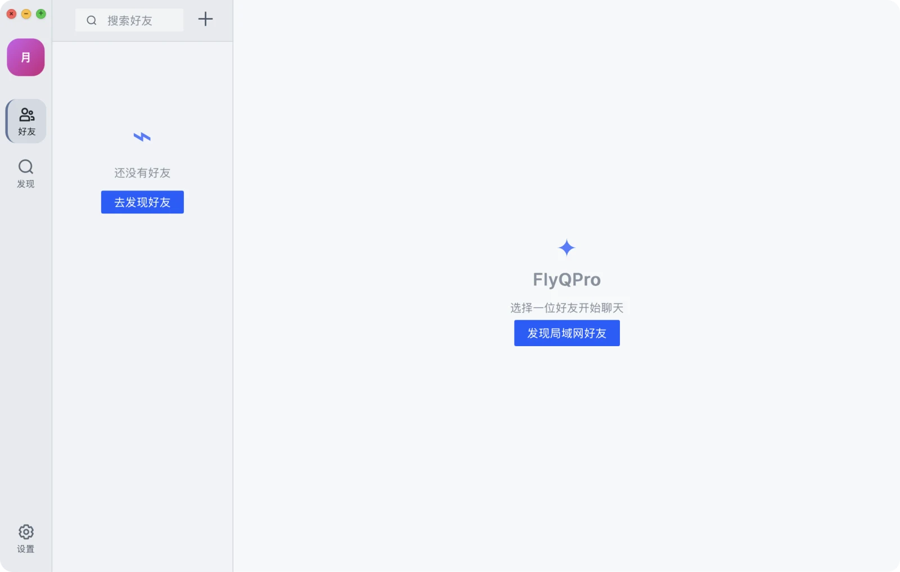
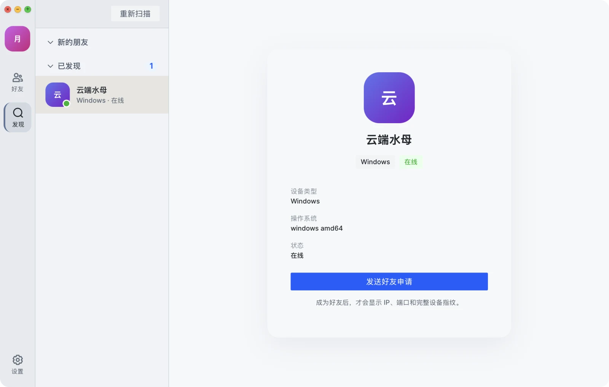
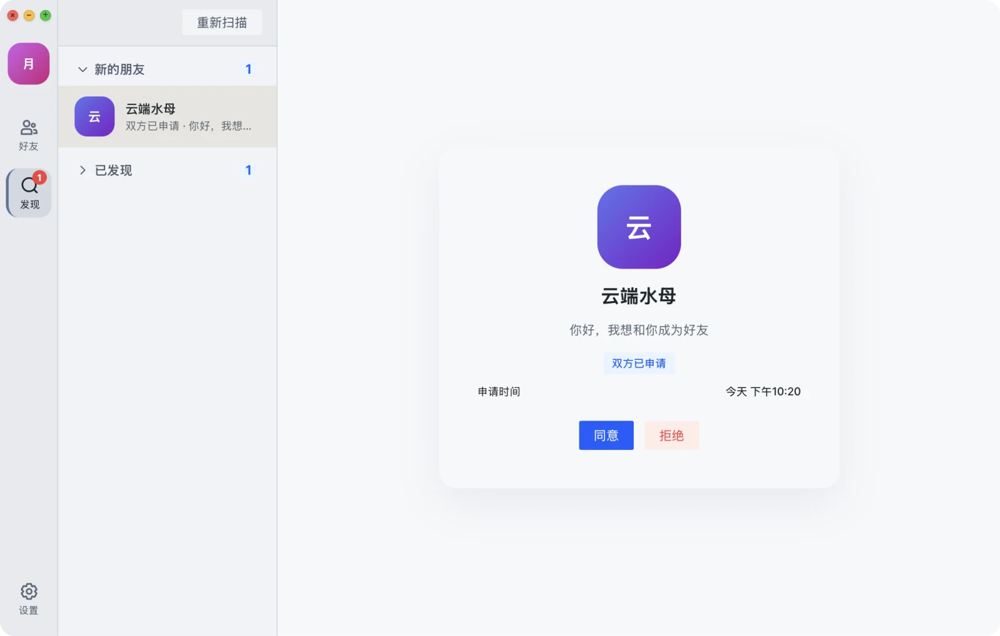
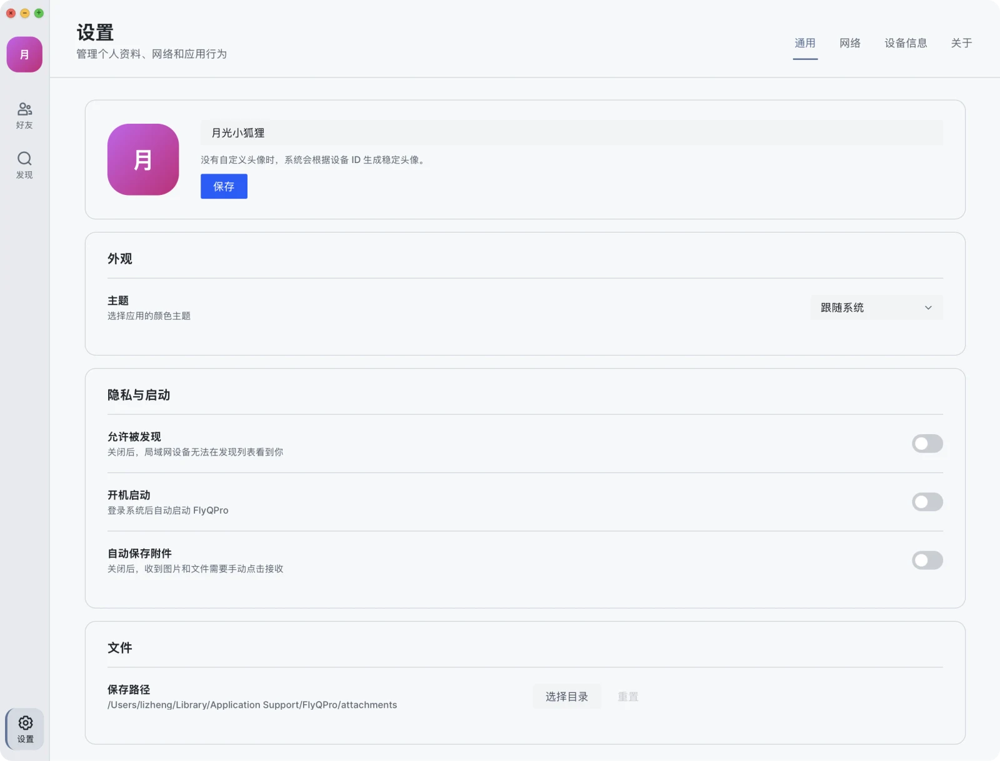
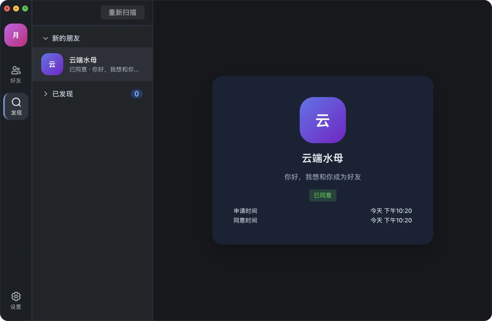
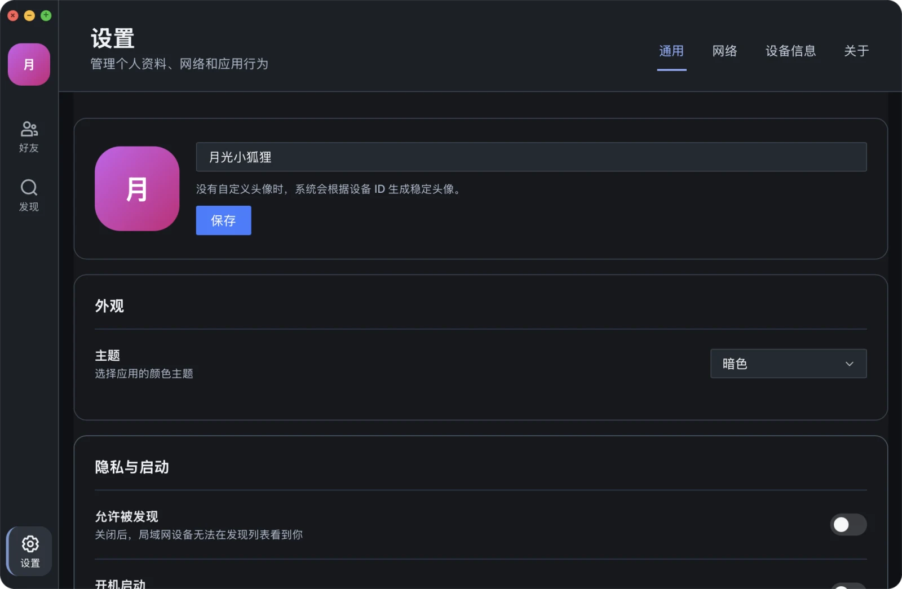

# FlyQPro

FlyQPro 是一款面向桌面端的局域网点对点聊天工具。它不依赖云端账号和中心服务器，设备在同一个局域网内即可发现彼此、添加好友、发送消息和传输图片/文件。

项目仓库：[gzdzh-cn/FLYQPro](https://github.com/gzdzh-cn/FlyQPro)

## 技术栈概览

- **桌面应用**：Wails 3，将 Go 后端与系统 WebView 结合为原生桌面程序。
- **界面**：Vue 3、TypeScript、Vite、Arco Design、Pinia。
- **后端**：Go、GoFrame，负责本地数据、设备发现和聊天服务。
- **数据存储**：SQLite，聊天记录、好友关系和设备资料保存在本机。
- **网络通信**：局域网 UDP/TCP 发现，好友连接使用 TLS 加密和设备身份校验。

## 适合什么场景

FlyQPro 适合在以下场景中使用：

- 同一家庭、办公室或实验室内的设备聊天。
- 不希望经过第三方服务器的临时局域网沟通。
- 在局域网内直接发送图片、文件和短消息。
- 需要保留本地聊天记录，同时对设备可见性进行控制。

> FlyQPro 当前定位是局域网通信工具。双方需要处于可互通的局域网环境，并允许应用通过系统防火墙接收连接。

## 界面预览

### 好友与发现

没有好友时，可以从好友页面进入发现流程：



发现设备、发送申请并等待对方处理：





### 聊天

支持文字、图片和表情消息：


### 亮色与暗色主题

FlyQPro 支持亮色、暗色和跟随系统三种主题模式：








## 功能一览

### 1. 局域网发现与好友管理

- 自动扫描同一局域网内已允许被发现的设备。
- 在“发现”页面查看设备名称、平台和在线状态。
- 发送、接收、同意或拒绝好友申请。
- 支持双方互相申请时合并显示申请状态。
- 好友与陌生设备分开管理，陌生设备不能直接查看完整设备指纹。
- 好友建立后，即使关闭“允许被发现”，双方仍可以直接连接和发送消息。

### 2. 点对点聊天

- 支持文字、表情和图片消息。
- 显示在线/离线状态、未读数量和消息发送状态。
- 支持已读状态和失败消息重发。
- 可点击好友头像查看好友资料、设备信息和最近在线时间。
- 可以为好友设置备注。

### 3. 文件与附件传输

- 从聊天输入区选择文件发送。
- 图片可直接在聊天窗口预览，也可以打开图片查看器浏览多张图片。
- 大文件传输显示实时进度。
- 接收文件时可以手动“接收”或“拒绝”。
- 开启“自动保存附件”后，收到的图片和文件会自动保存到附件目录。
- 支持自定义附件保存路径，并在更换路径时自动迁移已有附件。

### 4. 隐私与安全

- 默认不要求注册账号，也不会把聊天记录上传到云端。
- “允许被发现”控制陌生设备是否能在发现列表看到本机。
- 已有好友不受该开关影响，可以继续保持好友直连和消息通信。
- 关闭发现后不会向全网广播本机的发现请求，仅尝试与已知好友恢复连接。
- 聊天连接使用 TLS，设备通过本地生成的设备身份、公钥和证书指纹进行校验。
- 本机身份信息、好友关系、聊天记录和附件均保存在本地。

### 5. 个性化设置

- 修改昵称。
- 上传、替换或删除头像；没有自定义头像时会根据设备身份生成稳定头像。
- 亮色、暗色或跟随系统主题。
- 设置是否开机启动。
- 设置是否允许被发现。
- 设置是否自动保存附件及附件保存路径。

## 使用指南

### 第一步：启动并完善个人资料

启动 FlyQPro 后，点击左侧头像或“设置”，在“通用”页面修改昵称、头像和主题。

昵称会显示在好友发现、好友申请和聊天页面中。建议每台设备使用容易区分的昵称，例如“会议室电脑”或“张三的 Mac”。

### 第二步：让设备出现在发现列表

如果希望陌生设备发现本机：

1. 打开“设置”→“通用”。
2. 打开“允许被发现”。
3. 确认双方连接到同一个局域网。
4. 进入“发现”页面，点击“重新扫描”。
5. 点击设备查看详情，然后选择“发送好友申请”。

对方关闭“允许被发现”时，不会出现在陌生设备的发现列表中。已经成为好友的设备不受此开关影响，仍可以直接通信。

### 第三步：处理好友申请

收到申请后，进入“发现”页面的“新的朋友”区域，选择申请并点击“同意”或“拒绝”。

同意后，对方会移动到“好友”列表，之后可以直接打开聊天。双方都发送过申请时，页面会显示“双方已申请”。

### 第四步：发送消息和图片

在“好友”页面选择好友即可开始聊天：

- 在输入框输入文字，按 **Enter** 发送。
- 按 **Shift + Enter** 换行。
- 点击表情按钮插入表情。
- 点击文件夹按钮选择文件。
- 直接粘贴图片，或从文件选择器发送图片。

聊天窗口底部会显示消息通过局域网加密传输。图片发送后可以直接预览；普通文件会显示文件大小、传输进度和接收状态。

### 第五步：管理好友资料和聊天记录

打开聊天窗口右上角的“更多”按钮，可以查看：

- 好友昵称和备注。
- 在线状态、设备类型和操作系统。
- 通讯协议、IP 地址、设备 ID 和证书指纹。
- 最近在线时间。

在好友资料面板中点击“清除聊天记录”，只会清除本机保存的消息和附件，不会删除好友关系，也不会影响对方设备上的记录。

## 设置说明

### 允许被发现

控制陌生设备是否能在局域网发现列表看到本机。

- **开启**：陌生设备可以发现本机并发送好友申请。
- **关闭**：陌生设备不能通过发现列表看到本机；已建立的好友关系仍可直接通信。

### 自动保存附件

- **开启**：收到文件或图片后自动保存到附件目录。
- **关闭**：收到普通文件后，需要在消息中手动点击“接收”。

### 附件保存路径

可以选择新的本地目录。更换路径时，FlyQPro 会显示迁移进度，并在迁移期间暂时锁定其他页面，避免文件迁移过程中产生冲突。

### 网络

“设置”→“网络”页面可以查看：

- 当前网络状态和局域网 IP。
- UDP/TCP 发现端口。
- TCP/TLS 聊天端口。
- 已发现设备数量和在线设备数量。
- 网络诊断结果。

如果发现不到设备，请优先确认双方处于同一局域网，并检查系统防火墙、路由器 AP 隔离和网络权限。

### 设备信息

设备信息页面显示本机平台、操作系统、设备 ID、协议版本和证书指纹。这些信息用于设备识别和安全连接，正常情况下不需要手动修改。

## 数据和隐私

FlyQPro 不提供云端同步服务，数据默认保存在本机应用目录：

- **SQLite 数据库**：保存个人资料、设备信息、好友关系、好友申请、会话和消息记录。
- **附件目录**：保存接收的图片和文件，默认位于 FlyQPro 数据目录下的 `attachments` 文件夹。
- **设备身份**：用于验证好友连接，保存在本机。

可以通过环境变量 `FLYQPRO_DATA_DIR` 指定应用数据目录；也可以通过 `GOFLY_DB_PATH` 指定 SQLite 数据库文件路径。请在迁移或备份前退出 FlyQPro，避免数据库正在写入。

## 从源码运行

### 环境要求

- Go 1.25 或更高版本。
- Node.js 14 或更高版本，包含 npm。
- Wails 3 beta 版本及其对应的平台依赖。

### 启动开发模式

在 `FlyQPro-wails3` 目录执行：

```bash
npm --prefix frontend install
wails3 dev
```

开发模式会启动前端开发服务，并编译 Go 后端。修改前端或后端代码后，可按 Wails 的开发模式行为重新加载。

### 构建前端

```bash
cd frontend
npm install
npm run build
```

### 构建桌面程序

在项目目录执行：

```bash
wails3 build
```

完整的桌面安装包通常需要在目标操作系统上构建，因为 macOS、Windows 和 Linux 的窗口、签名、图标及安装器依赖不同。

### 运行测试

```bash
go test ./...
```

## 项目结构

```text
FlyQPro-wails3/
├── main.go                    # 应用入口、窗口和服务注册
├── frontend/                  # Vue 3 前端界面
│   └── src/
│       ├── views/chat/        # 好友、发现、聊天和设置页面
│       ├── store/modules/chat/ # 聊天状态、好友和消息状态
│       └── bindings/           # Wails 自动生成的前端绑定
├── internal/chat/             # 设备发现、好友、消息和文件传输
├── internal/service/          # Wails 暴露给前端的服务接口
├── internal/service/db/       # SQLite 初始化和数据库访问
├── protocol/                  # 通讯协议说明
├── resource/                  # 字体、图标等资源
└── docs/images/               # README 界面截图
```

## 常见问题

### 为什么发现不到对方？

请依次检查：

1. 双方是否连接到同一个局域网，而不是一个连接访客网络、另一个连接主网络。
2. 对方是否打开了“允许被发现”。
3. 是否点击了“重新扫描”。
4. 系统防火墙是否允许 FlyQPro 使用局域网网络。
5. 路由器是否开启了 AP 隔离、客户端隔离或设备间禁止通信。

### 关闭“允许被发现”后，还能和好友聊天吗？

可以。这个开关只控制陌生设备的发现列表可见性。已经建立好友关系的设备仍可以通过已保存的设备身份和地址直接连接。

### 聊天记录保存在哪里？

聊天记录保存在本机 SQLite 数据库，附件保存在设置中配置的附件目录。FlyQPro 不会自动把这些数据上传到云端。

### 更换附件目录会删除原文件吗？

正常迁移不会删除原有附件，FlyQPro 会将已管理的附件迁移到新目录，并在完成后更新本地记录。迁移过程中请不要退出应用。

## 使用提示

FlyQPro 仅用于你有权访问的局域网环境。请确认你有权发现和联系网络中的其他设备，并妥善保管本机数据库、附件目录及设备身份信息。
